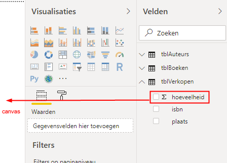

```{r setup, include=FALSE}
knitr::opts_chunk$set(
  echo = FALSE, 
  message = FALSE, 
  warning = FALSE, 
  dpi = 300, 
  tidy = 'styler'
  )
```

Met de mogelijkheden van de laatste versies van Excel ben je goed in staat om gegevens te analyseren en te visualiseren. Maar daarnaast heeft Microsoft hiervoor nog een andere applicatie, namelijk **Power BI**. Er zijn overeenkomsten en verschillen tussen Excel en Power BI. Aan Excel is al veel aandacht besteed, zie de gratis online cursus [LeerExcel](https://leerexcel.netlify.app/). In een tweetal artikelen wil ik je bekend laten maken met Power BI.

Microsoft Power BI bevat drie componenten, die je ook in Excel aantreft:

-  **Power Query**, waarmee je verbindingen maakt met gegevensbronnen en de gegevens kunt bewerken.
-  **Power Pivot**, waarmee je het gegevensmodel kunt instellen (relaties aanbrengen) en berekende kolommen en metingen (measures) kunt maken.
-  **Power View**, waarmee je de gegevens kunt visualiseren in de vorm van grafieken en andere elementen.


Wanneer je met Microsoft Power BI wilt werken heb je twee mogelijkheden.

-  Power BI service: een cloud gebaseerde online service
-  Power BI desktop: een applicatie op de lokale computer

Met beide kun je gratis werken. In deze tutorial vind je een kennismaking met de laatste. Om de oefeningen uit te voeren moet je uiteraard Power BI geïnstalleerd hebben. Dat kan via de link https://powerbi.microsoft.com/desktop. Je hebt wel een Microsoft account nodig.

Verder heb je het hulpbestand *boekenverkoop.xlsx* nodig dat je via deze website [hier](https://softwijs.nl/download/boekenverkoop.xlsx) kunt downloaden. Dit is een klein bestand met gegevens over de verkoop van boeken.

## Gegevens ophalen

Start Power BI Desktop op. Je krijgt nu het volgende scherm:


Kies aan de linkerkant van dit opstartscherm voor *Gegevens ophalen*. Kies daarna in het scherm dat verschijnt voor *Excel*. Klik daarna op de knop *Verbinding maken* en blader dan naar het bestand *boekenverkoop.xlsx*. Klik op *Openen*. Het venster Navigator verschijnt dan.


Het navigatievenster is een plaats waar je een voorbeeld van de gegevens van alle gegevensentiteiten in de gegevensbron kunt bekijken. Het excelbestand waar je nu verbinding mee maakt heeft drie werkbladen (Auteurs, Boeken, Verkopen). En elk van deze werkbladen bevat een tabel met gegevens (tblAuteurs, tblBoeken, tblVerkopen). Wanneer je een werkblad of tabel selecteert krijg je aan de rechterkant een voorbeeld van deze gegevens te zien. Omdat elk werkblad alleen maar één tabel bevat, maakt het niet uit of je een tabel of een werkblad selecteert.

Selecteer de drie tabellen en klik dan op de knop *Laden*.

Power BI laad nu de gegevens in het geheugen en probeert tevens relaties te leggen tussen de tabellen. Voordat je nu verder gaat moet je eerst controleren of er relaties aangebracht zijn en zoja of deze juist zijn. Zo niet dan zul je zelf de relaties moeten aanbrengen dan wel corrigeren.

Aan de linkerkant van het scherm zitten drie knoppen waarmee je kunt schakelen tussen de weergaves.


Klik op de knop *Model*.


De automatisch gelegde relaties zijn bij dit voorbeeld juist:

-  Tussen `tblAuteurs` en `tblBoeken` zit een 1 op veel relatie via het veld `auteur-id`.
-  Tussen `tblBoeken` en `tblVerkopen` zit een 1 op veel relatie via het veld `isbn`.

Nu het gegevensmodel in orde is kun je verder gaan met het maken van visualisaties voor een rapport.

Klik aan de linkerkant van het scherm op de knop *Rapport*.

Na het laden van de gegevens zie je in de rapportweergave aan de rechterkant van het scherm in het deelvenster Velden een lijst met de tabellen. Met de pijltjes omlaag kun je een tabel openklappen waarna de velden zichtbaar worden. Je gaat nu de eerste grafiek te maken.

## Visualisatie: Verkochte hoeveelheid per titel

Sleep het veld `hoeveelheid` uit de tabel `tblVerkopen` naar het grote lege canvas.



Deze actie creeert één visualisatie. De default visualisatie is een gegroepeerd kolomdiagram. In dit geval wordt er maar 1 kolom getekend welke het totaal aantal verkochte boeken weergeeft. Wanneer je de muis op de kolom plaatst zie dat het totale aantal 3592 is.


Aan de handgrepen om de figuur kun je zien dat deze visualisatie nog steeds geselecteerd is.

Om de verkochte aantallen per boek te zien moet je het veld `titel` uit de tabel `tblBoeken` in dezelfde visualisatie slepen.


De titel van het boek is langs de X-as geplaatst en de verkochte hoeveelheid langs de Y-as. Desgewenst kun je via de handgrepen de afmetingen wijzigen.

### Opmaak wijzigen

In het deelvenster Visualisaties zitten drie tabs waarmee je diverse instellingen voor de geselecteerde visualisatie kunt wijzigen. Met de middelste die de vorm van een verfroller heeft, kun je allerlei opmaakkenmerken instellen.


Zorg dat de grafiek geselecteerd is en selecteer daarna de tab *Indeling*.

Allereerst ga je de kleuren van de kolommen wijzigen. Klap *Gegevenskleuren* uit en stel daarna de standaardkleur in op rood.


Om ook het aantal verkochte boeken als een getal bij de kolom te plaatsen moet je de optie *Gegevenslabels* inschakelen.


Tot slot wordt de titel gewijzigd.

Klap opmaak voor *Titel* open en breng de volgende wijzigingen aan:

-  Titeltekst: Aantal verkocht per titel
-  Tekenkleur: zwart
-  Uitlijning: gecentreerd
-  Achtergrondkleur: grijs
-  Tekengrootte: 10 pt


## Opslaan

Power BI bestanden hebben standaard de extensie .pbix. Kies voor *Bestand opslaan* en bewaar het bestand onder de naam 'powerbi-desktop-1.pbix'.

In een volgend artikel zal het maken van een paar andere visualisaties uitgelegd worden.
