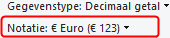
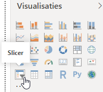

```{r setup, include=FALSE}
knitr::opts_chunk$set(
  echo = FALSE, 
  message = FALSE, 
  warning = FALSE, 
  dpi = 300, 
  tidy = 'styler'
  )
```


In het deel 1 van deze tutorial heb je kennis gemaakt met Power BI Desktop, een gegevensbestand ingeladen en een eerste visualisatie gemaakt. Het resulaat heb je als een Power BI bestand bewaard onder de naam *powerbi-desktop-1.pbix*. In dit artikel gaan we hiermee verder, maken een berekende kolom en voegen een paar meer visualisaties toe.

Start Power BI Desktop op en laad het bestand powerbi-desktop-1.pbix in. Wanneer je niet meer de beschikking over dit bestand hebt kun je het ook [hier](https://softwijs.nl/download/powerbi-desktop-1.pbix) downloaden.

## Visualisatie: Verkochte aantallen per plaats per categorie

In de tabel `tblVerkopen` zijn van elk boek de verkochte aantallen per plaats bijgehouden. En in de tabel `tblBoeken` kun je zien tot welke categorie een boek behoort. Interessant is nu om te weten welke categorie in welke plaats het meest populair is. Hiervoor is het grafiektype **Treemap** zeer geschikt, welke een hiërarchische weergave van de gegevens biedt, waardoor het relatief eenvoudig is om patronen te herkennen.

Om een nieuwe visualisatie in het canvas op te nemen moet je allereerst er voor zorgen dat geen bestaande visualisatie geselecteerd is. Klik nu op visualisatie Treemap.


Er wordt nu een treemap zonder inhoud in het canvas geplaatst. Sleep nu het veld `hoeveelheid` uit tabel `tblVerkopen` in de treemap. Er wordt nu 1 rechthoek gemaakt voor de totale hoeveelheid. Sleep vervolgens veld `plaats` uit tabel `tblVerkopen` in de treemap. Je krijgt nu via drie rechthoeken de hoeveelheid per plaats te zien.


Sleep vervolgens veld `categorie` uit tabel `tblBoeken` in de treemap. De grote rechthoek voor een plaats wordt nu opgedeeld in kleinere rechthoeken, 1 voor elke categorie. Om de namen van alle categorieën goed te zien moet je de treemap wat breder maken door aan de handgrepen aan de zijkanten te slepen.


Duidelijk is te zien dat in alledrie de plaatsen de categorie Reizen de meest verkochte boeken heeft

In het deelvenster Visualisaties kun je ook zien welke velden gebruikt zijn voorGroep, Details en Waarden.


In plaats van de velden in de treemap te slepen kun je ze ook naar deze lokaties slepen.

### Interactiviteit tussen grafieken

De visualisaties in het rapport zijn interactief. Je kunt ze gebruiken om te filteren. Wanneer je bijvoorbeeld in de treemap binnen de plaats Enschede op de categorie Reizen klikt, dan zie je in de andere grafiek met de gegroepeerde kolommen de titels die in deze categorie vallen.


En zo kun je ook in de kolomgrafiek op een boektitel klikken waardoor in de treemap een bijbehorend blokje getoond wordt.


Om de filtering ongedaan te maken klik je in de grafiek opnieuw op het item dat voor de filtering zorgt.

Geef tot slot de titel van de treemap een gelijke opmaak als de eerste grafiek.

## Visualisatie: Omzet per boek

Om de omzet per boek in een grafiek weer te geven moet de omzet eerst berekend worden. Dat kan door een nieuwe kolom te maken waarin de velden `prijs` en `hoeveelheid` met elkaar vermenigvuldigd worden.

Schakel via de knop in het linker zijpaneel over naar de *weergave Gegevens* en selecteer dan in het rechter deelvenster de tabel `tblVerkoop`.

Kies dan in het menu *tab Model maken -> Nieuwe kolom (groep Berekeningen)*.

Er wordt nu een nieuwe kolom aan de tabel toegevoegd en ook wordt een formulebalk zichtbaar met daarin de tekst `Kolom =`. Deze formulebalk lijkt op die in Excel, maar je kunt echter geen Excel formules gebruiken.

Power BI gebruikt een eigen formuletaal **DAX** geheten, wat staat voor Data Analysis eXpression. Je kunt een formule helemaal handmatig intypen, maar je kunt ook gebruik maken van **Intellisense**. Dit is een hulpmiddel dat bij het invoeren van een formule verschijnt. Tijdens het intypen wordt een lijst met namen van mogelijke functies, variabelen en eigenschappen getoond. Door op een onderdeel in de lijst te selecteren en dan op de TAB toets te drukken wordt het geselecteerde in de formule geplaatst. Je kunt ook dubbelklikken op de naam van het onderdeel.

Begin de formule met `Omzet = `

Hierna moet de veldnaam `hoeveelheid` uit de tabel `tblVerkopen` komen. Begin met het intypen van de beginletter `h`. Zodra je dat gedaan hebt worden er voorstellen getoond:


Bij lange lijsten is het aan te raden wat meer van de naam in te typen. De lijst wordt dan steeds kleiner waardoor het selecteren van het juiste item steeds gemakkelijker wordt.

In dit geval is de lijst klein en is het juiste onderdeel al zichtbaar. Dat is `tblVerkopen[hoeveelheid]`. Voeg deze aan de formule toe, zodat er komt te staan `Omzet = tblVerkopen[hoeveelheid]`.

De syntax in DAX is steeds tabelnaam[veldnaam].

Nu moet er nog vermenigvuldigd worden met het veld `prijs`.

Begin met het intypen van `*pr`. Echter nu toont intellisense niet het onderdeel dat toegevoegd moet worden. In zijn algemeenheid betekent dit ook dat je een fout maakt, dat je het zo niet in kunt voeren. De reden dat het juiste veld niet getoond wordt is dat het veld `prijs` niet in de geselecteerde tabel `tblVerkopen` zit, maar in de tabel `tblBoeken`. Gelukkig is deze tabel gerelateerd aan de tabel `tblVerkopen`. Door gebruik te maken van de DAX functie `RELATED` kun je een veld uit een gerelateerde tabel toevoegen.

Verwijder het ingetypte `pr` en hervat het intypen met `re`. Nu wordt de functie `RELATED` zichtbaar. Voeg deze aan de formule toe. Er wordt dan een lange lijst met functies uit de gerelateerde tabellen zichtbaar. Je kunt het gewenste veld in deze lijst opzoeken, maar het is handiger om de eerste letter(s) van de veldnaam in te typen.

Typ een `p` in. Nu wordt maar één veld getoond en dat is de gezochte `tblBoeken[prijs]`. Voeg deze aan de formule toe.

De formule is nu `Omzet = tblVerkopen[hoeveelheid]*tblBoeken[prijs]`. De formule is hiermee klaar. Sluit af met de *ENTER* toets.

De berekende waarden verschijnen in de nieuwe kolom die ook gelijk de naam `Omzet` krijgt.


Om het nog wat te verfraaien ga je de bedragen opmaken in de euro notatie.

De opmaak van een geselecteerde kolom kun je via tab *Model maken* op het lint vinden. De huidige opmaak is de notatie `Algemeen`.


Verander via de keuzelijst de notatie in `Euro`.



Nu er een veld voor omzet is kan een grafiek voor de omzet per boek gemaakt worden.

Schakel over naar de indeling *Rapport*. Zorg er voor dat geen visualisatie in het canvas geselecteerd is. Sleep nu het veld `Omzet` uit de tabel `tblVerkopen` naar een lege plek in het canvas. Sleep daarna het veld `Titel` uit de tabel `tblBoeken` in de nieuwe visualisatie. Pas de titel aan op overeenkomstige wijze als bij de twee andere grafieken.


## Visualisatie: Totale omzet

Wanneer je slechts één waarde (getal, tekst) wilt weergeven dan is de visualisatie **Kaart** een goede keuze.


Klik op de visualisatie Kaart zodat deze aan het canvas toegevoegd wordt. Sleep daarna het veld `Omzet` uit de `tblVerkopen` in de visualisatie.

De totale omzet is € 74.748,95. Echter deze waarde wordt standaard weergegeven als duizendtallen, in dit geval dus als € 74,75K. De weergave-eenheid kun je als volgt wijzigen.

Klik in het deelvenster **Visualisatie** op de tab **Indeling** (afgebeeld als een verfroller). Klap *Gegevenslabel* open. Kies dan bij * *weergave-eenheden* voor `Geen`. Schakel verder de weergave van het *categorielabel* uit.

Maak een titel met de tekst "Totale omzet" en pas deze op overeenkomstige wijze als bij de andere grafieken.

## Visualisatie: Filter op prijsklasse

Fiteren op basis van getallen (en ook datums) kan goed met een zogeheten **Slicer** (afbeelding met trechter).



Voeg een slicer aan het canvas toe en sleep hierin het veld `prijs` uit de tabel `tblBoeken`. Geef deze visualisatie een titel met de tekst "Filter op prijsklasse" en geef deze dezelfde opmaak als de andere visualisaties.

Experimenteer met de grenswaarden van de slicer en let op de interacties met de andere visualisaties. Om de selecties te wissen kun je op de daarvoor bestemde knop in de rechterbovenhoek van de slicer klikken:


## Titel Rapport

Een mooi rapport hoort een titel met een logo te hebben. Maak aan de bovenkant van het canvas wat ruimte voor een logo en een titel door de andere visualisaties wat te verschuiven.

Een afbeelding en een tekst kun je toevoegen via het menu *Startpagina -> Afbeelding (respectievelijk Tekstvak)*.


Het door mij gebruikte logo kun je  [hier](https://softwijs.nl/download/icon-boeken.png) vinden.


## Eindrapport

Je kunt nu de visualisaties nog wat verschuiven of de afmetingen wat aanpassen zodat het er wat gelikter uitziet. Een voorbeeld:


## Opslaan

Sla het bestand op onder de naam `powerbi-desktop-2.pbix`.

