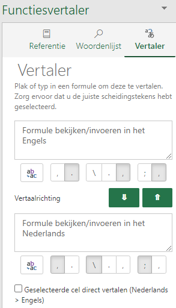

Veel van de Excel blogs die ik lees zijn Engelstalig. Af en toe komt het voor dat ik van een Engelstalige formule de Nederlandse vertaling niet ken. Dan wordt het uitproberen of ik zoek op het web de vertaling op. Kort geleden ontdekte ik dat Microsoft hiervoor een add-in heeft, genaamd **Functievertaler**, zie het artikel [Functievertaler van Excel](https://support.office.com/nl-nl/article/functievertaler-van-excel-f262d0c0-991c-485b-89b6-32cc8d326889)

De installatie voor Excel 365 verliep iets anders dan aangegeven:

*Excel opstarten > tab Invoegen > Invoegtoepassingen downloaden > Functions translator intypen in het zoekvak > Selecteren > Toevoegen*

De add-in werkt erg handig en ik gebruik deze nu ook omgekeerd van het Nederlands naar het Engels.
