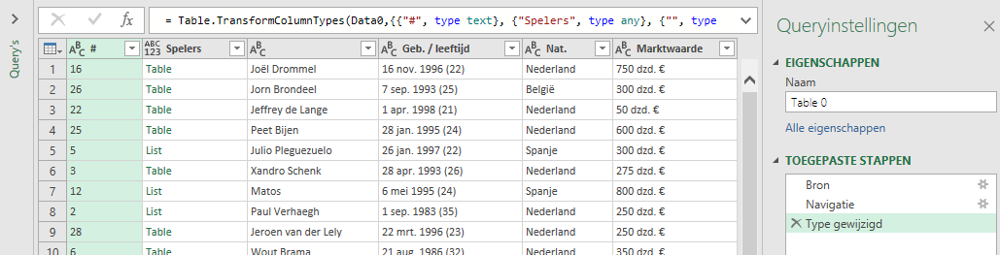

Afgelopen zaterdag was ik bij de openingswedstrijd van FC Twente voor het seizoen 2019/2020. Veel nieuwe spelers gezien en op de terugweg naar huis was ik benieuwd naar de marktwaarde van de huidige selectie en toekomstige wijzigingen daarin. Het Duitse bedrijf Transfermarkt publiceert veel data over clubs en spelers, waaronder ook hun inschatting van de marktwaarde van de spelers. Naast een algemene url heeft het bedrijf ook landspecifieke urls's:

-  Algemeen: https://www.transfermarkt.com/
-  Duitsland: https://www.transfermarkt.de/
-  Nederland: https://www.transfermarkt.nl/
-  ...

Om analyses met Excel uit te kunnen voeren moet je de gegevens eerst in een werkblad in een geschikt formaat beschikbaar hebben. Een leuke uitdaging met behulp van Power Query. In de stappen hierna zie je hoe ik dat voor FC Twente heb uitgevoerd, maar je kunt het natuurlijk ook voor jouw eigen favoriete club uitvoeren. De enige aanpassing is dan de url van de club.

Wanneer je Nederlandse url van Transfermarkt gebruikt is het land *Nederland* al voor je geselecteerd. Daarna kies je als competitie de *Eredivisie* en vervolgens de *club*, in mijn voorbeeld dus FC Twente. Klikken op de knop **>>** achter de clubnaam brengt je naar de clubpagina. Het eerste tabblad *Compact* bevat de gezochte informatie: Spelersnaam, Geboortedatum, nationaliteit, Contractduur en Marktwaarde. Noteer de URL van deze pagina, in mijn geval https://www.transfermarkt.nl/jumplist/startseite/verein/317

Nu je de URL gevonden hebt kun je de browser sluiten, Excel opstarten,een lege werkmap openen en een query maken om de informatie op te halen en te bewerken.

### Gegevens ophalen

Kies **Gegevens > Van het web**. Voer de genoteerde URL in en klik OK. Na even wachten verschijnt het venster Navigator met in de linkerkant de mogelijke tabellen. Je moet nu uitzoeken in welke tabel de gezochte informatie zit. Wanneer je een tabel selecteert krijg je in het rechterdeel een voorbeeld van de gegevens te zien. Je hoeft niet lang te zoeken want de eerste tabel *Table 0* is al de goede tabel.

Klik op **Gegevens transformeren**. Power Query Editor wordt opgestart met daarin de gegevens.

Verwijder de eerste twee kolommen. Hernoem de kolom met de namen van de spelers in "Speler". Wijzig de naam van de query in "Voetbalclub".

De inhoud van de kolommen *Geb./leeftijd* en *Marktwaarde* is niet zodanig dat je er in Excel goed mee kunt werken. Een geboortedatum willen we in de vorm "16-11-1996". De leeftijd is geen vast kenmerk, maar een berekend gegeven en moet verwijderd worden. En voor de marktwaarde moet alleen een getal komen. Voor dit herstructureren van gegevens leent Power Query zich uitstekend.

### Geboortedatum

Wanneer je de gegevens in de kolom *Geb./leeftijd* bekijkt dan zie dat dag, maand, jaartal en leeftijd steeds van elkaar gescheiden worden door een spatie. Dat betekent dat je de inhoud van deze kolom kunt splitsen en over vier nieuwe kolommen kunt verdelen.

Selecteer kolom *Geb./leeftijd*. Kies **tab Transformeren > Kolom splitsen (groep Kolom Tekst) > Op scheidingsteken**. Selecteer de **spatie** als scheidingsteken en ook dat er op elke spatie gesplitst moet worden.

Klik op **OK**. De oude kolom is nu verdwenen en er zijn vier nieuwe kolommen voor terug gekomen. Verwijder de laatste hiervan, die waarin de leeftijden als negatieve getallen staan. Wijzig de naam van de andere drie kolommen in resp. *dag*, *maand* en *jaar*.

Achter de maandnaam staat een punt. Deze moet verwijderd worden anders kunnen de datumfuncties van Excel er niet mee overweg. Selecteer de kolom *maand*. Kies **tab Transformeren > Waarden vervangen (groep Alle kolommen)**.Specificeer voor de te zoeken waarde een *punt* en laat het vakje voor de te vervangen waarde leeg. Klik **OK**.

Nu moet er uit dag, maand en jaar een nieuwe kolom met de geboortedata gemaakt worden. Kies **tab Kolom toevoegen > Aangepaste kolom**. Noem de nieuwe kolom "Geboortedatum" en voer de volgende formule in: `= Text.From([dag]) & "-" & [maand] & "-" & Text.From([jaar])`

Klik op **OK**. Het gegevenstype van deze kolom moet nog op Datum gezet worden. Met de kolom Geboortedatum nog geselecteerd kies je **tab Startpagina > Gegevenstype (groep Transformeren) > Datum**. Verwijder daarna de overbodige kolommen *dag*, *maand* en *jaar*.

### Marktwaarde

De gegevens in de kolom *Marktwaarde* eindigen allemaal met `. €`. Dit moet eerst verwijderd worden.

Selecteer de kolom *Marktwaarde*. Kies **tab Transformeren > Waarden vervangen (groep Alle kolommen)**.Specificeer voor de te zoeken waarde `. €` en laat het vakje voor de te vervangen waarde leeg. Klik **OK**.

De inhoud van de kolom Marktwaarde bestaat nu uit een getal en een tekstaanduiding voor de eenheid, welke van elkaar gescheiden zijn door een spatie. Ga op dezelfde manier als bij geboortedatum te werk om deze kolom te splitsen op de spatie. De oude kolom wordt hierdoor vervangen door twee nieuwe kolommen: *Marktwaarde.1* met het getal en *Marktwaarde.2* met de eenheid.

De tekst van deze eenheid ga je nu vervangen door het overeenkomstige getal. Selecteer kolom *Marktwaarde.2*. Vervang nu de waarde `dzd` door `1000` en daarna de waarde `mln` door `1000000`. Wijzig daarna het gegevenstype van deze kolom in *Geheel getal*.

Nu kan er een nieuwe kolom *Marktwaarde* door de inhoud van de twee kolommen met elkaar te vermenigvuldigen. Kies **tab Kolom toevoegen > Aangepaste kolom**. Noem de nieuwe kolom *Marktwaarde* en voer de volgende formule in: `= [Marktwaarde.1]*[Marktwaarde.2]`

Klik op **OK**. Wijzig het gegevenstype van deze kolom in *Valuta*. Verwijder vervolgens de overbodig geworden kolommen *Marktwaarde.1* en *Marktwaarde.2*.

### Laden in Excel

De query is nu klaar en de gegevens kunnen in een Excel werkblad geladen worden. Kies **tab Startpagina > Sluiten en laden**.

Maak in het Excel werkblad de inhoud van Marktwaarde op als Valuta zonder decimalen.

Voeg tot slot een totaalrij toe via **tab Tabelontwerp > aanvinken Totaalrij (groep Opties voor tabelstijlen)**.

Wanneer de marktwaarde van een speler wijzigt, er spelers vertrekken of bijkomen, hoef je alleen maar de query te vernieuwen via **tab Gegevens > Alles vernieuwen (groep Query's en verbindingen)**.

|Merk verder op dat bij twee spelers geen nationaliteit vermeld is. Onderzoek van de brondata laat zien dat deze twee spelers een dubbele nationaliteit hebben. Blijkbaar kan de query daar niet mee overweg.
