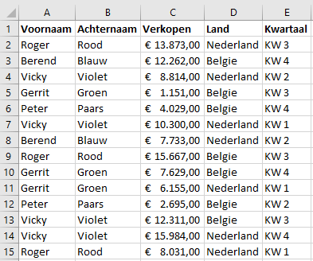
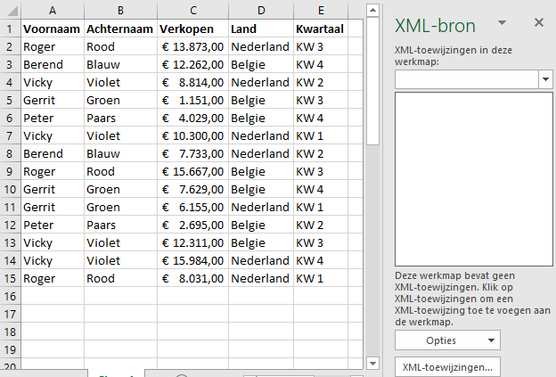
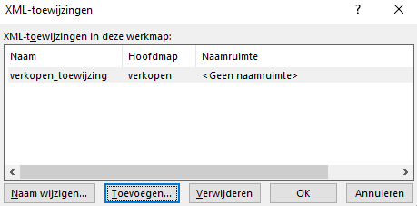
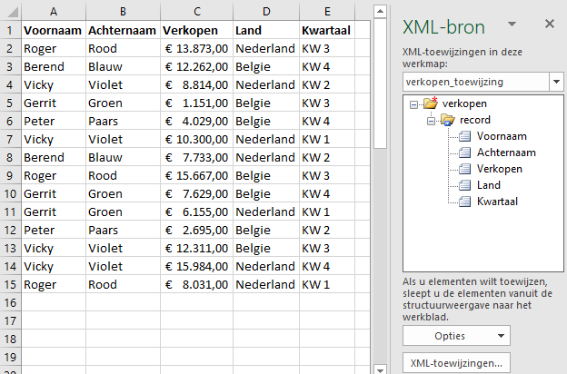
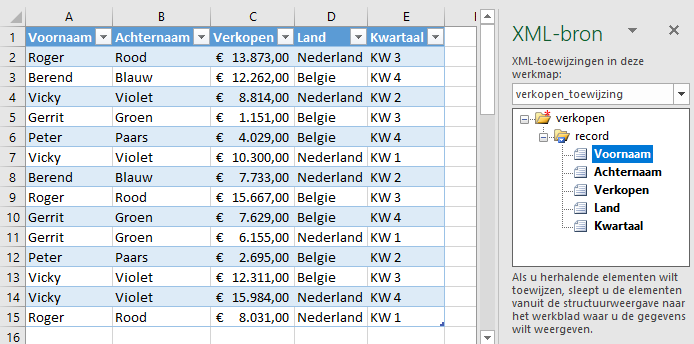

Het is niet moeilijk om de gegevens in een Excel tabel naar een XML bestand om te zetten.

Download het bestand [verkopen-data.xlsx](verkopen-data.xlsx) en open het vervolgens in Excel. In een Excel tabel staan de volgende gegevens:



Om deze naar XML te exporteren moet er eerst een XML schema gemaakt worden dat gebaseerd is op deze gegevens. In plaats van een officieel schema of DTD te maken kun je ook een eenvoudig XML bestand maken met daarin de eerste twee records. Open een kladblok programma en plaats daarin het de volgende tekst.

```
<?xml version="1.0" encoding="UTF-8" standalone="yes"?>
<verkopen xmlns:xsi="http://www.w3.org/2001/XMLSchema-instance">
    <record>
       <Voornaam>Roger</Voornaam>
       <Achternaam>Rood</Achternaam>
       <Verkopen>13873</Verkopen>
       <Land>Nederland</Land>
       <Kwartaal>KW 3</Kwartaal>
    </record>
    <record>
       <Voornaam>Berend</Voornaam>
       <Achternaam>Blauw</Achternaam>
       <Verkopen>12262</Verkopen>
       <Land>Belgie</Land>
       <Kwartaal>KW 4</Kwartaal>
    </record>
</verkopen>
```

Sla het bestand in dezelfde map als het Excel bestand op onder de naam *verkopen-schema.xml* en sluit het kladblok programma.

Ga nu terug naar het geopende Excelbestand. Kies *tab Ontwikkelaars > Bron (groep XML)*. Het XML taak paneel wordt nu geopend.



Klik op *XML-toewijzingen* om een XML bestand toe te voegen. Een dialoogvenster wordt nu geopend. Klik hierin op *Toevoegen* en selecteer daarna *verkopen-schema.xml*.

Je krijgt nu een waarschuwing dat de opgegeven XML-bron niet naar eenschema verwijst en dat Excel op basis van dit bestand een schema maakt. Klik op *OK*.



Klik op *OK*.



Sleep nu een voor een de vijf elementen (Voornaam, Achternaam, Verkopen, Land, Kwartaal) uit de XML-boom naar de juiste kolom in het werkblad.



Je kunt controleren of de toewijzing goed uitgevoerd is, door de elementen in de XML-bron een voor een aan te klikken. De bijbehorende kolom uit de tabel moet dan geselecteerd worden.

Kies *tab Ontwikkelaars > Exporteren (groep XML)*. Bewaar het bestand onder de naam *verkopen-xml.xml*. 
