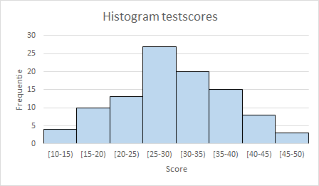

Bracht het maken van een histogram in oudere versies van Excel veel handwerk met zich mee, in de nieuwere versies (Excel 365, Excel 2016) is dit een stuk gemakkelijker gemaakt. Een probleem is wel dat het histogram er vaak nooit zo uitziet als je graag zou willen. En dat het maken van bepaalde aanpassingen soms moeilijk tot zelfs onmogelijk is, waardoor je toch weer op het handwerk met formules terug moet grijpen.

In een aantal artikelen wordt aandacht besteed aan wat je allemaal tegen kunt komen. In dit eerste deel gaat het over de basis voor een histogram, de frequentieverdeling.

**Frequentieverdelingen**

Om het gedrag van een variabele te bestuderen ga je waarden van die variabele verzamelen, bijvoorbeeld door metingen uit te voeren. De *frequentie* van een waarde is het aantal malen dat die waarde voorkomt. Deze frequenties worden dan geordend in een tabel waardoor er een *frequentieverdeling* ontstaat.

Naast deze *absolute frequentie* kun je ook de *relatieve frequentie* bepalen. Dit is het aantal malen dat een meetwaarde voorkomt gedeeld door het totaal aantal waarnemingen. De relatieve frequentie wordt uitgedrukt als fractie of als een percentage. En tot slot kun je ook nog de *cumulatieve frequentie* bepalen. Dit is de som van alle frequenties tot en met de frequentie van de desbetreffende waarde. En de cumulatieve frequentie kun je zowel absoluut als relatief uitdrukken.

Meestal zijn er van een variabele veel meetwaarden beschikbaar. Dan is het niet handig om van de afzonderlijke waarden een frequentieverdeling te maken omdat dit een lange lijst wordt welke niet meer inzicht in de variabele zal geven. In dat geval worden de frequenties samengevat in groepen, zogenaamde *klassen* of ook wel *bins* geheten.. Het samenbrengen in klassen heet ook wel *classificeren*.

De grenzen van de klasse, de ondergrens en bovengrens, worden met een combinatie van ronde haken () en blokhaken [] aangeduid. Een ronde haak betekent dat de grenswaarde niet tot de klasse behoort. Een blokhaak betekent dat de grenswaarde wel tot de klasse behoort. Zo hoort bij een klasse aangeduid met [25,40) de waarde 25 wel tot de klasse, maar de waarde 40 niet.

De *klassebreedte* is het verschil tussen de bovengrens en de ondergrens van een klasse. Zo heeft de klasse [25,40) een klassebreedte 15. Het bepalen van de klassebreedte wordt door de onderzoeker bepaald en hangt vaak van de onderzoeksvraag af. Ook voor het totaal aantal klassen gelden geen harde afspraken. Is de klassebreedte groot, dan heb je minder klassen, maar krijg je ook minder inzicht. Sommige onderzoekers hanteren als vuistregel voor het aantal klassen: maximaal de wortel uit het totaal aantal waarnemingen.

Voor het maken van klassen gelden de volgende regels.

Harde regels:

+ De klassen mogen geen overlappingen vertonen. Een waarneming moet slechts in één klasse ondergebracht kunnen worden. Een klassindeling met hierin de klassen [25,50] en [50,75] kan dus niet. Want dit zou inhouden dat de waarde 50 tot 2 klassen kan behoren.
+ Voor elke waarneming moet er een klasse beschikbaar zijn. Dus alle waarnemingen moeten in een klasse ondergebracht kunnen worden. Vaak worden daarom de eerste en laatste klasse extra groot gemaakt.

Zachte regels (voor de klassebreedte):

+ Als het kan maak dan de klassen even breed. Veel software (en vooral Excel) kan hier beter mee overweg dan wanneer de klassen niet even breed zijn. Voor de eerste en de laatste klasse lukt dat niet alijd omdat alle waarnemingen opgevangen moeten worden. Daarnaast kunnen er ook andere redenen zijn om de klassen niet even breed te maken. Ook worden soms klassen waarin weinig waarnemingen zitten samengevoegd waardoor een bredere klasse ontstaat.
+ De klassen moeten wel voldoende differentieren, verschillen vertonen. Zo heeft het weinig zin om voor de inkomensverdeling in Nederland een klasse van €10.000 tot €60.000 te maken, omdat hierin bijna alle inkomens (> 90%) vallen.

**Een histogram is een grafische weergave van een frequentieverdeling van gegevens.**

**Voorbeeld testscores**

Aan een test wordt door 100 personen deelgenomen. De volgende tabel geeft een overzicht van de frequenties, relatieve frequenties en cumulatieve relatieve frequenties. De laatste twee als fracties. Alle klassen hebben hier dezelfde breedte 10.

|score  |freq.|rel. freq.|cum. rel. freq.|
|:-----:|:---:|:--------:|:-------------:|
|[10,20)|14   |0,14      |0,14           |
|[20,30)|40   |0,40      |0,54           |
|[30,40)|35   |0,35      |0,89           |
|[40,50)|11   |0,11      |1,00           |

In dit voorbeeld werd uitgegaan van een bestaande frequentieverdeling. De gegevens zelf zijn door het classificeren niet meer bekend, waardoor er veel informatie verdwenen is. Wanneer je wat dieper op de verdeling zou willen inzoomen, moet je de klassebreedte verkleinen naar bijvoorbeeld 5, zoals in de volgende afbeelding te zien is.

Beide diagrammen zijn tot stand gekomen door een kolomdiagram in Excel te maken. Wie dit zelf na wil maken in Excel kan het bestand [testscores.xlsx](/download/testscores.xlsx) downloaden. Hierin zijn ook de benodigde aanwijzingen voor het maken van dit diagram te vinden. Zoals in het begin van dit artikel is aangegeven heeft Excel specifieke hulpmiddelen voor het maken van histogrammen. Deze zullen nog aan bod komen.

In het volgende artikel zal het maken van een frequentieverdeling van een gegevensverzameling besproken worden.
