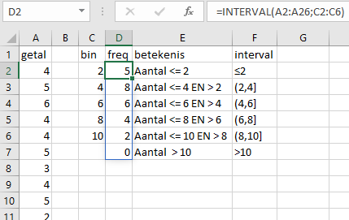
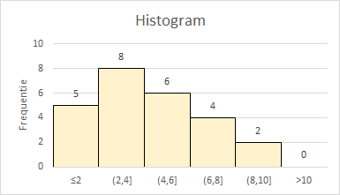
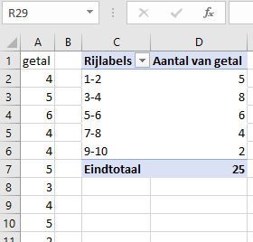

In het eerste artikel over histogrammen werd van een gegeven frequentieverdeling gebruik gemaakt. Normaliter moet je van de gegevens eerst een frequentieverdeling maken. Er zijn meerdere manieren om een freqentieverdeling te maken, al dan niet met ook een histogram.

+ Met de formule INTERVAL
+ Met een draaitabel en draaigrafiek
+ Met de histogram optie in gegevensanalyse (Analysis Toolpak)
+ Via Invoegen > grafieken > Histogram (alleen histogram, geen afzonderlijke frequenties)

Welke manier je gebruikt hangt meestal af van de gewenste uitvoer en de mogelijkheden tot het maken van aanpassingen.

## INTERVAL functie (Eng: FREQUENCY)

Syntax: *INTERVAL(gegevensmatrix;interval_verw)*

+ *gegevensmatrix* (Eng: data_array), een matrix met de waarden waarvan je de frequentie wilt bepalen
+ *interval_verw* (Eng: bins_array), een matrix met de bovengrenzen van de intervallen waarin je wilt verdelen

Als voorbeeld zijn 25 willekeurige gehele getallen gegenereerd uit het interval [1,10]. Hoe je dat moet doen kun je lezen in het artikel [Aselecte getallen](https://softwijs.nl/excel/asecte-getallen/).

Het bestand met deze getallen, alsmede alle uitwerkingen in dit artikel kun je downloaden via de link [frequenties.xlsx](/download/frequenties.xlsx).

Om hiervoor een frequentieverdeling te maken moet je eerst de intervallen vaststellen waarin je de waarden wilt laten vallen. Deze intervallen of groepen worden meestal **bins** genoemd. Hiervoor maak je een kolom met de bovengrenzen van de intervallen. In de afbeelding staan deze in de kolom "bin".

De frequenties staan in de kolom "freq" en zijn berekend met de formule `=INTERVAL(A2:A26;C2:C6)`. Deze formule is een zogenaamde **matrixformule**. 

**Excel 365**

In Excel 365 kun je deze matrixformule gewoon in de begincel D2 invoeren en vervolgens op Enter drukken. Het resultaat is een kolommetje getallen, een matrix. En Excel weet welke cellen nodig zijn voor de uitvoer en plaatst het resultaat van deze *dynamische matrix* in deze cellen. Deze cellen moeten wel leeg zijn anders krijg je een foutmelding.

**Andere Excel versies**

Andere versies van Excel kunnen niet met deze nieuwe dynamische matrices overweg. Hier moet je de formule nog op de "oude" manier invoeren. Je moet dan zelf eerst het uitvoerbereik D2:D7 selecteren, dan de formule intypen en vervolgens op CTRL + SHIFT + ENTER drukken. Excel plaatst dan zelf accolades {} aan het begin en het einde van de formule.

**Histogram maken**

Wanneer je eenmaal de frequentieverdeling gemaakt hebt kun je een histogram maken op basis van een kolomdiagram. In [deel 1](https://softwijs.nl/excel/histogrammen-1/) zie je daarvan een voorbeeld en in het bijbehorende bestand testscores wordt uitgelegd hoe je dat moet doen.

## Draaitabel

Ook met een draaitabel kun je een frequentieverdeling maken. Selecteer het gegevensgebied A1:A26 en dan tab *Invoegen > Draaitabel*. Plaats het veld `getal` in zowel het rijengebied als het waardengebied. Wijzig de waardeveldinstellingen zodat het aantal bepaald wordt en niet de som.

Nu moet je nog groeperen voor de intervals. Selecteer een willekeurig veld in de draaitabel, rechter muisklik en kies dan *Groeperen*. Specificeer in het dialoogscherm dat wordt begonnen bij 1, geëindigd bij 10 en dat de stapgrootte 2 is. Zie de volgende afbeelding.

Na het groeperen verschijnt de frequentieverdeling.

## Gegevensanalyse (Analysis Toolpak)

Ook hier moet je net als bij de functie `INTERVAL` een bereik voor de grenzen van de intervallen maken.

Kies *tab Ggegevens > Gegevensanalyse > Histogram*.

Specificeer het invoerbereik en het verzamelbereik, alsmede een cel voor het begin van de uitvoer. Wanneer je een histogram wilt kun je in dit scherm ook aangeven dat er een grafiek gemaakt moet worden

De grafiek is een gegroepeerde kolomdiagram die je desgewenst nog kunt aanpassen. Voor een echt histogram moeten de kolommen aansluitend zijn zonder lege ruimte ertussen. En de labels op de X-as geven hier alleen de bovengrens en niet het interval.

Een nadeel is ook dat wanneer de brondata wijzigt, er geen herbereking plaatsvindt. De frequentieverdeling (en histogram is statisch)

## Grafiek Histogram

De nieuwere Excelversies hebben de mogelijkheid tot het invoegen van een *grafiektype Histogram*. Hiervoor heb je in principe alleen maar de brondata nodig. Bij de verdeling in intervallen (bins) bepaalt Excel zelf automatisch deze bins. Maar je kunt via het eigenschappenvenster ook de binbreedte of het aantal bins opgeven. De bijbehorende intervalgrenzen worden dan door Excel berekend. Wanneer je ook nog de grenswaarden zelf wilt bepalen, dan moet je daarvoor een aparte kolom in het werkblad opnemen.

De werkwijze is als volgt. Selecteer een getal in het gegevensgebied. Kies dan *tab Invoegen > Aanbevolen grafieken > Alle grafieken > Histogram*.

In Excel wordt een histogram gewoonlijk als een kolomdiagram weergegeven met labels onder het midden van de kolom. En de kolommen worden standaard aaneensluitend getekend.

> Wanneer je het aantal bins of de Bin-breedte wilt veranderen, selecteer dan de horizontale as > Rechter muisklik > As opmaken. Maak het eigenschappen breed genoeg, anders zijn niet alle invulvelden zichtbaar.
