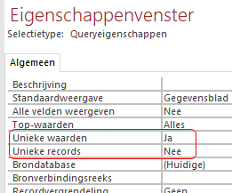
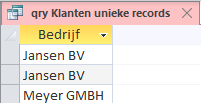

```{r setup, include=FALSE}
knitr::opts_chunk$set(
  echo = FALSE, 
  message = FALSE, 
  warning = FALSE, 
  dpi = 300, 
  tidy = 'styler'
  )
```

# Inleiding

In het eigenschappen venster van een query zijn twee opties, *Unieke Waarden* en *Unieke Records*. Standaard staat de waarde voor beiden op *Nee*. Deze leveren soms dezelfde waarden op, maar er zijn significante verschillen wanneer je een van beide op *Ja* zet. Verder kun je niet beide waarden op *Ja* zetten.

> Deze eigenschappen corresponderen met respectievelijk de SQL opdrachten  
> *DISTINCT* en *DISTINCTROW*.

+  **Standaard**, wanneer beide eigenschappen dus *Nee* zijn, worden alle records getoond die aan de queryvoorwaarden voldoen.

+  **Unieke Waarden** (DISTINCT in SQL) controleert alleen de uitvoervelden van de query en verwijdert daarna de dubbele rijen. Bij meerdere uitvoervelden moet de combinatie van alle uitvoervelden uniek zijn.

+  **Unieke Records** (DISTINCTROW in SQL) daarentegen controleert alle velden in de tabel die wordt opgevraagd en verwijdert duplicaten. De getoonde records moeten uniek zijn op basis van alle velden in de onderliggende tabellen en niet alleen de velden in de query.

Verdere uitleg via een Voorbeeld met een eenvoudige database "Voorbeeld_Uniek.accdb". Deze bevat twee tabellen:

```{r tabel-klanten, echo=FALSE, fig.cap="Tabel Klanten.", out.width="50%"}
knitr::include_graphics("tabel-klanten.png")
```

```{r tabel-orders, echo=FALSE, fig.cap="Tabel Orders.", out.width="50%"}
knitr::include_graphics("tabel-orders.png")
```

Tussen de tabellen is een een-op-veel relatie van Klanten.Klantnr > Orders.Klantnr.

Zoals je ziet zijn er twee verschillende klanten met dezelfde naam voor Bedrijf. In de query's hierna wordt steeds deze naam getoond voor de drie verschillende mogelijkheden.

# qry Klanten standaard

**Ontwerp**

Onder deze naam is een query gemaakt waar beide tabellen aan zijn toegevoegd. Het ontwerpvenster ziet er als volgt uit:

```{r qry-standaard-ontwerp, echo=FALSE, fig.cap="Ontwerp query Klanten standaard.", out.width="50%"}
knitr::include_graphics("qry-standaard-ontwerp.png")
```

```{r qry-standaard-eigenschappen, echo=FALSE, fig.cap="Eigenschappen query Klanten standaard.", out.width="50%"}
knitr::include_graphics("qry-standaard-eigenschappen.png")
```

Wanneer je met SQL werkt, dan is de opdracht:

```
SELECT Klanten.Bedrijf
FROM Klanten
INNER JOIN Orders ON Klanten.Klantnr = Orders.Klantnr;
```

**RESULTAAT**

```{r qry-standaard-resultaat, echo=FALSE, fig.cap="Vier rijen, voor elke klantorder is er een rij, alle records worden getoond.", out.width="50%"}

```

# qry Klanten unieke waarden

**Ontwerp**

In het Eigenschappenvenster wordt `Unieke waarden = Ja`.

```{r qry-uniekewaarden-ontwerp, echo=FALSE, fig.cap="Ontwerp qry Klanten unieke waarden.", out.width="50%"}

```

Wanneer je met SQL werkt, dan is de opdracht:

```
SELECT DISTINCT Klanten.Bedrijf
FROM Klanten
INNER JOIN Orders ON Klanten.Klantnr = Orders.Klantnr;
```

**Resultaat**

```{r qry-uniekewaarden-resultaat, echo=FALSE, fig.cap="Twee unieke rijen, de resultaten worden beperkt tot unieke waarden in het uitvoerveld.", out.width="50%"}
knitr::include_graphics("qry-uniekewaarden-resultaat.png")
```

# qry Klanten unieke records

**Ontwerp**

In het Eigenschappenvenster wordt `Unieke records = Ja`.

```{r qry-uniekerecords-ontwerp, echo=FALSE, fig.cap="Ontwerp qry Klanten unieke records.", out.width="50%"}

```

Wanneer je met SQL werkt, dan is de opdracht:

```
SELECT DISTINCTROW Klanten.Bedrijf
FROM Klanten
INNER JOIN Orders ON Klanten.Klantnr = Orders.Klantnr;
```

**Resultaat**

```{r qry-uniekerecords-resultaat, echo=FALSE, fig.cap="Drie rijen, want de resultaten in alle onderliggende tabellen moeten uniek zijn, dus niet de uitvoervelden.", out.width="50%"}

```

Je ziet hier twee keer “Jansen BV”. Weliswaar is dat niet uniek in het uitvoerveld, maar ze zijn uniek omdat de ene in Amsterdam zit en de andere in Londen.

Wanneer je zelf met deze datase wilt werken dan kun je deze hier downloaden: [Database Voorbeeld_Uniek](Voorbeeld_Uniek.accdb)
