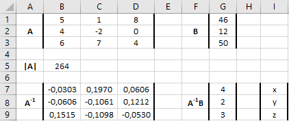

# Wat is een matrix in Excel?

Een vector is een lijstje met getallen die of in een rij of in een kolom staan. Je hebt dan respectievelijke een rijvector of een kolomvector. Excel gebruikt niet de term vector, maar matrix (Engelstalig: Array). Een matrix in Excel kan zijn:

**1-dimensionaal horizontaal**

Een rij met waarden (eigenlijk een rijvector).

```{r array-h, echo=FALSE, fig.cap="Horizontale matrix", out.width="100%"}
knitr::include_graphics("array-h.png")
```

**1-dimensionaal verticaal**

Een kolom met waarden (eigenlijk een kolomvector).

```{r array-v, echo=FALSE, fig.cap="Verticale matrix", out.width="100%"}
knitr::include_graphics("array-v.png")
```

**2-dimensionaal**

Een rechthoek van rijen en kolommen met waarden, een gebied dus.

```{r array-hv, echo=FALSE, fig.cap="Rechhoekige matrix", out.width="100%"}
knitr::include_graphics("array-hv.png")
```

**Invoeren van een matrix**

Een matrix met constante waarden zoals in de getoonde drie voorbeelden maak je door in een cel te beginnen met het `=` symbool en dan een rijtje waarden tussen accolades `{ }` te plaatsen. De waarden moeten van elkaar gescheiden worden door een speciaal symbool. Welke symbolen je moet gebruiken als scheidingssymbool hangt af van de taal- en landinstellingen op de computer.

Table: (\#tab:symbolen) Symbolen voor scheiding van rijen en kolommen.

| Taalinstelling | Kolom | Rij |
|:---------------|:-----:|----:|
| Nederlands     | `\`   | `;` |
| Engels         | `,`   | `;` |

Verder moet een matrix invoeren in volgorde van rijen (dus rij voor rij) en alle rijen moeten evenveel kolommen hebben.

De drie voorbeelden hiervoor zijn als volgt in Excel ingevoerd.

1. `={1\2\3\4\5}` geeft 1 rij met 5 kolommen.
2. `={1;3;6}` geeft 3 rijen met 1 kolom.
3. `={1\2\3\4\5;3\5\7\9\11;6\9\12\15\18}` geeft 3 rijen met 5 kolommen.

**Let op:**

Voor alle voorbeelden geldt dat alleen de eerste cel bewerkbaar is. Dat is de cel waar de matrix is ingevoerd. Wanneer je een andere cel in het waardengebied selecteert, dan is de inhoud in de formulebalk grijs gekleurd en kun je de waarde niet wijzigen.

## Dynamisch gedrag

In Excel 365 zijn de matrices dynamisch.

Een matrixformule die in één cel op het werkblad wordt ingevoerd kan resultaten in meerdere cellen op het werkblad plaatsen. Dit gedrag wordt **overlopen** (Engels: *spilling*) genoemd en de resultaten verschijnen in een **overloopgebied** (*spill-range*). Welke en hoeveel cellen gebruikt worden hangt van het resultaat van de formule af. Als de broninhoud van de formule verandert worden de resultaten dynamisch bijgewerkt en kan het zijn dat het overloopgebied groeit of krimpt. Je krijgt een foutmelding *#OVERLOOP!* wanneer het overlopen geblokkeerd wordt doordat cellen van het overloopgebied al een inhoud hebben.

**Verwijzing naar overloopgebied**

Om een verwijzing naar een overloopgebied te maken zet je een hash symbool `#` achter het adres van de eerste cel van het overloopgebied. Is bijvoorbeeld het overloopgebied J2:N4, dan verwijs je hiernaar met `=J2#`.

Je kunt deze verwijzing ook in een formule opnemen. Zo geeft bijvoorbeeld `=AANTAL(J2#)` als antwoord 15, het aantal cellen in dit gebied. Wanneer later de grootte van het overloopgebied verandert, dan verandert ook het resultaat van de formule.

**Naamgeving matrix**

Wanneer je met matrices gaat rekenen, is het erg handig om deze van een naam te voorzien. Dat kan op dezelfde manier als het toekennen van een naam aan een cel. In de formules kun je dan met de naam van de matrix werken.

# Wiskundige bewerkingen

## Scalaire bewerkingen

Bij een matrix kan een *scalair* (dit is één getal) opgeteld of afgetrokken worden. En ook kun je een matrix met een scalair vermenigvuldigen of daardoor delen. In alle gevallen wordt de bewerking op de afzonderlijke elementen van de matrix toegepast. Het resultaat is een matrix van dezelfde afmetingen.

```{r scalair, echo=FALSE, fig.cap="Scalaire bewerkingen uitgevoerd op een matrix. Het scalaire getal staat steeds in kolom E.", out.width="100%"}
knitr::include_graphics("scalair.png")
```

<aside>
A1:  
`={1\2\3;3\5\7;6\9\12}`
A7, A12, A17:  
`=A2#`  
G2:  
`=A2# + E2`  
G7:  
`=A7# - E7`  
G12:  
`=A12# * E12`  
G17:  
`=A17# / E17`
</aside>

## Optellen en aftrekken van matrices

Matrices met dezelfde afmetingen kunnen opgeteld of afgetrokken worden. De overeenkomstige elementen worden dan opgeteld of afgetrokken. Het resultaat is een matrix van dezelfde afmetingen.

```{r opt-aftr, echo=FALSE, fig.cap="Optellen en aftrekken van Twee matrices", out.width="100%"}
knitr::include_graphics("opt-aftr.png")
```

<aside>
A1:  
`={5\7;8\4;3\2}`  
D1:  
`={3\1;9\6;8\3}`  
G1:  
`=A1# + D1#`  
A6:  
`=A1#`  
D6:  
`=D1#`  
G6:  
`=A6# + D6#`
</aside>

Opmerking: In plaats van eerst de matrices in afzonderlijke cellen in te voeren kun je deze ook in de formule opnemen, bijvoorbeeld `={5\7;8\4;3\2} + {3\1;9\6;8\3}`.

## Vermenigvuldigen van matrices

Twee matrices kunnen vermenigvuldigd worden wanneer ze passende afmetingen hebben. Dat is het geval wanneer het aantal kolommen in de eerste matrix gelijk is aan het aantal rijen van de tweede matrix. Het resultaat is een matrix met het aantal rijen van de eerste matrix en het aantal kolommen van de tweede matrix. Dus een $m \times n$ matrix kun je vermenigvuldigen met een $n \times o$ matrix en het resultaat is een $m \times o$ matrix.

Er vindt een rij x kolom vermenigvuldiging plaats. Als demonstratie van hoe dit in zijn werk gaat wordt in het volgende voorbeeld een $3 \times 2$ matrix vermenigvuldigd met een $2 \times 3$ matrix met als resultaat een $3 \times 3$ matrix.

\[\left[ {\begin{array}{*{20}{c}}
1&2\\
3&4\\
5&6
\end{array}} \right] \times \left[ {\begin{array}{*{20}{c}}
1&2&3\\
4&5&6
\end{array}} \right] = \left[ {\begin{array}{*{20}{c}}
{1 \times 1 + 2 \times 4}&{1 \times 2 + 2 \times 5}&{1 \times 3 + 2 \times 6}\\
{3 \times 1 + 4 \times 4}&{3 \times 2 + 4 \times 5}&{3 \times 3 + 4 \times 6}\\
{5 \times 1 + 6 \times 4}&{5 \times 2 + 6 \times 5}&{5 \times 3 + 6 \times 6}
\end{array}} \right] = \left[ {\begin{array}{*{20}{c}}
9&{12}&{15}\\
{19}&{26}&{33}\\
{29}&{40}&{51}
\end{array}} \right]\]

Formule Excel: `PRODUCTMAT(matrix1;matrix2)`

```{r vermenigvuldiging, echo=FALSE, fig.cap="Vermenigvuldiging van twee matrices", out.width="100%"}
knitr::include_graphics("vermenigvuldiging.png")
```

<aside>
A2:  
`={1\2;3\4;5\6}`  
D2:  
`={1\2\3;4\5\6}`  
H2:  
`=PRODUCTMAT(A2#;D2#)`
</aside>

# Getransponeerde matrix

De getransponeerde van matrix $A$ wordt meestal aangeduid met $A^T$. Om een matrix te transponeren verwissel je de rijen en de kolommen. Dus de rijen van $A$ worden de kolommen van $A^T$. Heeft $A$ de afmetingen $m \times n$, dan heeft $A^T$ de afmetingen $n \times m$. Een voorbeeld.

Als $A = \left[ \begin{matrix} 1 & 2 \\ 3 & 4 \\ 5 & 6 \end{matrix} \right]$, dan is $A^T = \left[ \begin{matrix} 1 & 3 & 5 \\ 2 & 4 & 6  \end{matrix} \right]$

Formule Excel: `TRANSPONEREN()`

```{r transponeren, echo=FALSE, fig.cap="Transponeren van een matrix", out.width="100%"}
knitr::include_graphics("transponeren.png")
```

<aside>
A2:  
`={1\2;3\4;5\6}`  
D2:  
`=TRANSPONEREN(A2#)`
</aside>

# Eenheidsmatrix

Een eenheidsmatrix, ook wel identiteitsmatrix genoemd, is een *vierkante* matrix, waarvan de hoofddiagonaal (van linksboven naar rechtsonder) uitsluitend uit enen bestaat en alle andere elementen nul zijn. Een eenheidsmatrix wordt meestal aangeduid met $I$.

Een eenheidsmatrix kun je in Excel genereren met de functie `EENHEIDMAT(n)` waarbij n de afmeting (dimensie) is.

```{r eenheidsmatrix, echo=FALSE, fig.cap="Voorbeeld van een eenheidsmatrix 5x5.", out.width="100%"}
knitr::include_graphics("eenheidsmatrix.png")
```

<aside>
A1:  
`=EENHEIDMAT(5)`
</aside>

Ga na dat $I^T = I$

# Determinant

De determinant van een *vierkante* matrix is een speciaal getal dat uit de elementen van die matrix berekend kan worden. De determinant van matrix $A$ wordt meestal aangeduid met $|A|$ en soms ook wel met $det(A)$. De determinant wordt vaak gebruikt bij het oplossen van stelsels vergelijkingen met meerdere variabelen.

**Berekening determinant voor een $2 \times 2$ matrix**

$\begin{vmatrix} a & b \\ c & d \end{vmatrix} = ad - bc$

Een voorbeeld met getallen:

$\begin{vmatrix} 5 & 8 \\ 7 & 12 \end{vmatrix} = 5 \times 12 - 8 \times 7 = 60 -56 = 4$

**Berekening determinant voor een $3 \times 3$ matrix**

$\begin{vmatrix} a & b & c \\ d & e & f \\ g & h & i \end{vmatrix} = a\begin{vmatrix} e & f \\ h & i \end{vmatrix} - b\begin{vmatrix} d & f \\ g & i \end{vmatrix} + c\begin{vmatrix} d & e \\ g & h \end{vmatrix}$

Een voorbeeld met getallen:

$\begin{vmatrix} 1 & 4 & 3 \\ 5 & 2 & 7 \\ 8 & 6 & 12 \end{vmatrix} = 1\begin{vmatrix} 2 & 7 \\ 6 & 12 \end{vmatrix} - 4\begin{vmatrix} 5 & 7 \\ 8 & 12 \end{vmatrix} + 3\begin{vmatrix} 5 & 2 \\ 8 & 6 \end{vmatrix} = \\ 1(24-42) -4(60-56) + 3(30-16) = 18 -16 + 42 = 8$

**Formule Excel**: `DETERMINANTMAT()`

```{r determinant, echo=FALSE, fig.cap="Voorbeelden van de berekening van de determinant", out.width="100%"}
knitr::include_graphics("determinant.png")
```

<aside>
E1:  
`=DETERMINANTMAT(A1#)`  
E5:  
`=DETERMINANTMAT(A5#)`
</aside>

Ga na dat de determinant van een eenheidsmatrix gelijk is aan 1.

Deze procedure kan recursief worden toegepast voor de determinant van een $n \times n$ matrix en staat bekend als de Laplace-expansie.

# Inverse matrix

De inverse van een matrix $A$ wordt aangeduid met $A^{-1}$. Bij vermenigvuldiging van een matrix met zijn inverse krijg je je de eenheidsmatrix $I$:

$A \cdot A^{-1} = I$.

*Alleen vierkante matrices, maar niet alle, kunnen geinverteerd worden*. Een vierkante matrix kan alleen geinverteerd worden wanneer de determinant ongelijk aan nul is. Als de inverse bestaat heet de matrix *inverteerbaar*. Het inverteren van een matrix is vaak zeer bewerkelijk. Net als de determinant wordt de inverse gebruikt bij het oplossen van stelsels vergelijkingen met meerdere variabelen.

**Formule Excel**: `INVERSEMAT()`

```{r inverse, echo=FALSE, fig.cap="Het inverteren van een matrix.", out.width="100%"}

```

<aside>
A2:  
`={1\-1;4\6}`  
A6:  
`=DETERMINANTMAT(A2#)`
D2:  
`=INVERSEMAT(A2#)`  
G2:  
`=PRODUCTMAT(A2#;D2#)`
</aside>

In A2 is matrix $A$ ingevoerd. In A6 is met de formule `=DETERMINANTMAT(A2#)` de determinant van A, $|A|$, berekend, welke gelijk aan 10 is. Dus niet nul, dus matrix A is inverteerbaar. In D2 is de $A^{-1}$ berekend met de formule `=INVERSEMAT(A2#)`. In G2 is matrixproduct $A A^{-1}$ berekend, welke gelijk is aan de eenheidsmatrix. De berekende waarde in H2 is zo goed als gelijk aan $0$.

# Stelsel vergelijkingen oplossen

Een stelsel van drie vergelijkingen met drie variabelen:

$$\begin{array}{lclclcl}
5x &+& 1y &+& 8z &=& 46 \\
4x &-& 2y &&     &=& 12 \\
6x &+& 7y &+& 4z &=& 50
\end{array}$$

In matrixnotatie kan dit geschreven worden als $AX = B$

met $A = \left[ \begin{matrix} 5 & 1 & 8 \\ 4 & -2 & 0 \\ 6 & 7 & 4 \end{matrix} \right]$, $X = \left[ \begin{matrix} x \\ y \\ z \end{matrix} \right]$ en $B = \left[ \begin{matrix} 46 \\ 12 \\ 50 \end{matrix} \right]$

Eerst in het kort de wiskundige achtergrond. Wanneer de inverse $A^{-1}$ bestaat, dan kun je beide kanten van de vergelijking hiermee vermenigvuldigen:

$A^{-1}AX = A^{-1}B$

Omdat $A^{-1}A$ gelijk is aan de eenheidsmatrix kan dit herschreven worden als $X = A^{-1}B$. Je kunt dus $X$ bepalen door het matrix product van $A^{-1}$ en $B$ te berekenen.

**Uitvoering in Excel**

```{r vergelijkingen, echo=FALSE, fig.cap="Het oplossen van een stelsel van drie vergelijkingen met drie onkende variabelen", out.width="100%"}

```

<aside>
B1:  
`={5\1\8;4\-2\0;6\7\4}`  
G1:  
`={46;12;50}`  
B5:  
`=DETERMINANTMAT(B1#)`  
B7:  
`=INVERSEMAT(B1#)`  
G7:  
`=PRODUCTMAT(B7#;G1#)`
</aside>

De formule voor matrix $A$ en $B$ staan in respectievelijk cel B1 en cel G1. Om te controleren of de inverse van $A$ bestaat moet de determinant $|A|$ berekend worden. Dat is gedaan in cel B5 en deze is 264. De inverse bestaat dus en is vervolgens berekend in cel B7. Tot slot kan het matrixproduct $A^{-1}B$ in cel G7 bepaald worden.

De oplossing van het stelsel vergelijkingen is dus $x=4$, $y=2$ en $z=3$.
