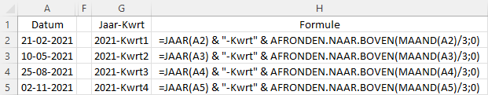

Met de functies `JAAR()`, `MAAND()` en `DAG()` kun je jaar, maand en dag uit een datum halen. Nu moet ik bij analyses van tijdreeksen nogal eens weten in welk kwartaal een datum valt. Helaas heeft Excel hiervoor geen functie, maar met een formule is dat eenvoudig te doen. Zie de twee soorten formules in het volgende voorbeeld.

Weliswaar zien de formules er verschillend uit, maar het principe is hetzelfde.

  + Bij de formule in kolom C wordt eerst het maandnummer bepaald, welke dan door 3 gedeeld wordt om vervolgens de uitkomst naar boven af te ronden.
  + Bij de formule in kolom E wordt ook eerst het maandnummer bepaald, waar dan 2 bij opgeteld wordt, dan wordt deze uitkomst door 3 gedeeld om vervolgens het getal voor de komma te nemen.

Het is dan ook niet zo moeilijk meer om met een van beide formules constructies te maken als in de volgende figuur:

Bij gebruik van draaitabellen kan Excel zelf tijdgerelateerde velden automatisch uit een datum halen. Zie in mijn studieboek het voorbeeld [Groeperen van gegevens](https://leerexcel.netlify.app/pivots.html#pivots-grouping-data).
