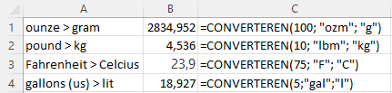

Bij mijn hobby bierbrouwen put ik regelmatig uit Amerikaanse boeken en artikelen. De daar gehanteerde eenheden als pounds, gallons, Fahrenheit moet ik dan omrekenen naar in dit geval kilogram, liter en Celsius. Erg handig daarbij is de Excel functie `CONVERTEREN()`. Met deze ingebouwde functie kun je een maateenheid omzetten naar een andere maateenheid van dezelfde soort. Dus eenheid van massa naar een andere eenheid van massa, of een eeheid van volume naar een andere eenheid van volume.

Syntax: CONVERTEREN(getal; van_eenheid; naar_eenheid)

+ `getal`: de waarde (of celverwijzing) die je wilt converteren.
+ `van_eenheid`: de huidige eenheid.
+ `naar_eenheid`: de gewenste eenheid.

Voor de eenheden moet je specifieke tekstwaarden (dus tussen dubbele aanhalingstekens) gebruiken. Een overzicht van de toegestane tekstwaarden kun je vinden op [Microsoft support](https://support.microsoft.com/nl-nl/office/converteren-functie-d785bef1-808e-4aac-bdcd-666c810f9af2). let er op dat deze tekstwaarden hoofdlettergevoelig

## Eenvoudige conversies

In de volgende afbeelding zie je een voorbeeld van een paar eenvoudige conversies, waarbij steeds één eenheid wordt omgezet naar één andere eenheid.

De functie kun je ook tot een macht verheffen. Zo kun je 10 square feet omzetten naar vierkante meters met de formule `=CONVERTEREN(10; "ft"; "m")^2`.

Metrische eenheden kunnen voorafgegaan worden door een *prefix* die de waarde met een macht van 10 vermenigvuldigt. In de tabel hierna zie je een aantal veel gebruikte waarden.

|Prefix|Waarde |Afkorting|Prefix|Waarde  |Afkorting|
|------|:-----:|:-------:|------|:------:|:-------:|
|tera  |10^12^ |"T"      |deci  |10^-1^  |"d"      |
|giga  |10^9^  |"G"      |centi |10^-2^  |"c"      |
|mega  |10^6^  |"M"      |milli |10^-3^  |"m"      |
|kilo  |10^3^  |"k"      |micro |10^-6^  |"u"      |
|hecto |10^2^  |"h"      |nano  |10^-9^  |"n"      |
|deca  |10     |"e"      |pico  |10^-12^ |"p"      |

+ 4000 meter omrekenen naar kilometer: `=CONVERTEREN(4000;"m";"km")`
+ 0,5 liter omrekenen naar milliliter: `=CONVERTEREN(0,5;"l";"ml")`

## Complexere conversies

Een mooi voorbeeld van een wat complexere omzetting heb je bij eenheden voor druk, de kracht per oppervlakte. Deze wordt berekend met de formule $p = \frac{F}{A}$, waarbij $F$ staat voor de kracht (Force) en $A$ voor de oppervlakte (Area). In het [SI stelsel](https://nl.wikipedia.org/wiki/SI-stelsel) is de eenheid van druk de pascal, met `1 Pa = 1 N/m^2^`. In de VS is de `psi` (pounds per square inch) gebruikelijk.

Om 1 psi om te zetten naar N/m^2^ moet je dus de (kracht)pounds omzetten naar Newton en de square inch naar vierkante meter. Dat kan met de formule  
`=CONVERTEREN(1;"lbf";"N")/CONVERTEREN(1;"in";"m")^2`.  
In plaats van een deling kun je er ook een vermenigvuldiging van maken door in de laatste formule de eenheden te verwisselen. De formule wordt dan  
`=CONVERTEREN(1;"lbf";"N")*CONVERTEREN(1;"m";"in")^2`.

Gelukkig bestaat er ook een rechtstreekse omzetting van psi naar pascal met `=CONVERTEREN(1;"psi";"Pa")` of naar kilo Pascal met  
`=CONVERTEREN(1;"psi";"kPa")`.
