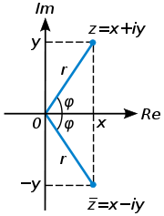

## Complex getal

Een complex getal wordt vaak voorgesteld door de letter $z$ en weergegeven op twee manieren:

$z = x +iy = \rho(cos \phi + i sin \phi)$

Hierin zijn $x$, $y$, $\rho$ en $\phi$ reële getallen en wordt $i$ de *imaginaire eenheid* genoemd met als eigenschap $i^2 = -1$.

+ $x$ : *Reële deel* van $z$
+ $y$ : *Imaginaire deel* van $z$
+ $\rho$: *Modulus* van $z$ (de absolute waarde)
+ $\phi$: *Argument* van $z$

De relaties tussen deze vier getallen zijn

$\rho = \sqrt{x^2 + y^2}$, $\cos \phi = \frac{x}{\rho}$,  $\sin\phi = \frac{y}{\rho}$

```{r}

```


## Excel

Je kunt in Excel met complexe getallen werken, maar niet op dezelfde manier als met reële getallen.

Om te beginnen moet je een complex getal invoeren met de functie `COMPLEX`

Syntax: `COMPLEX(reëel_deel;imaginair_deel;[achtervoegsel])`

+ `reëel_deel`: De reële coëfficiënt van het complexe getal. Vereist.
+ `imaginair_deel`: De imaginaire coëfficiënt van het complexe getal. Vereist.
+ `achtervoegsel` : Symbool voor de imaginaire eenheid (defaultwaarde "i"). Optioneel. Voor wanneer je bijvoorbeeld $j$ als symbool wilt gebruiken.

Wanneer je in een cel de formule `=COMPLEX(3;4)` invoert, dan is de de uitvoer `3+4i`

Wanneer je rekenkundige bewerkingen met complexe getallen wilt uitvoeren dan kun je dat niet met de normale symbolen doen. Wil je bijvoorbeeld de complexe getallen $3 +4i$ en $7 - 2i$ bij elkaar optellen, dan kan dat niet met de formule `=COMPLEX(3;4) + COMPLEX(7;-2)`, dat geeft als uitvoer `#WAARDE!`.

Voor het werken met complexe getallen zijn speciale functies beschikbaar die in de Engelstalige versie met `IM` beginnen en in de Nederlandstalige versie met `C.`. In de tabel hierna staan een aantal veel gebruikte functies.


| EN          | NL           | Betekenis         |
|:------------|:-------------|:------------------|
|`IMSUM`      |`C.SOM`       |Optellen           |
|`IMSUB`      |`C.VERSCHIL`  |Aftrekken          |
|`IMPRODUCT`  |`C.PRODUCT`   |Vermenigvuldigen   |
|`IMDIV`      |`C.QUOTIENT`  |Delen              |
|`IMABS`      |`C.ABS`       |Absolute waarde    |
|`IMARGUMENT` |`C.ARGUMENT`  |Argument           |
|`IMCONJUGATE`|`C.TOEGEVOEGD`|Toegevoegd complex |
|`IMREAL`     |`C.REEEL.DEEL`|Reële deel         |
|`IMAGINARY`  |`C.IM.DEEL`   |Imaginair deel     |
|`IMABS`      |`C.ABS`       |Modulus            |
|`IMARGUMENT` |`C.ARGUMENT`  |Argument           |
