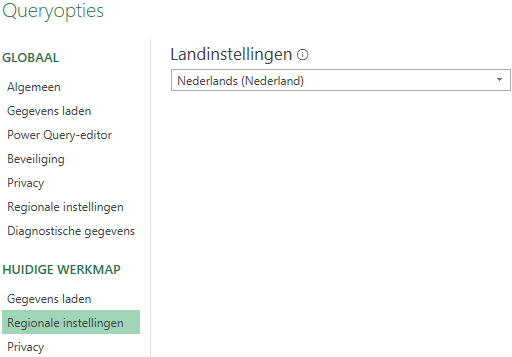
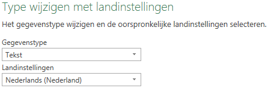

Veel gegevensbestanden zijn platte bestanden ( .txt, .csv, ...). Dit soort bestanden heeft geen metalaag of schema waarin beschreven staat hoe de gegevens geïnterpreteerd moeten worden. Wanneer deze gegevens in Excel geïmporteerd worden doet Power Query wel een poging hiertoe. Dat gaat vaak goed, maar vooral bij numerieke- en datumgegevens uit Engelstalige bronnen gaat het vaak fout.

+ *Numerieke gegevens*: Engelstalige landen gebruiken een punt als decimaalteken en een komma als scheidingdteken voor duizendtallen. In Nederland (en veel andere Europese landen) is dit precies andersom, een komma als decimaal teken en een punt voor de duizendtallen.
+ *Datums*: In de VS is de opmaak meestal mm/dd/jjjj en in Europa dd/mm/jjjj.

Het is aan te raden om altijd zo'n plat bestand eerst met een programma als kladblok of Notepad te bekijken om dit vast te stellen.

## Instellingen besturingssysteem

Wanneer je met een nieuw Excelbestand begint en hierin via Power Query gegevens uit een plat bestand importeert, dan wordt door Power Query de locale versie van het besturingssysteem gebruikt als standaardinstelling. Met deze instelling wordt bepaald hoe Power Query de gegevens interpreteert.Je kunt in Windows deze instellingen vinden en wijzigen via **Configuratiescherm > Tijd en taal > Land/regio**.

De gebruikte landinstelling wordt in de query bewaard. Wanneer het Excelbestand later door een andere gebruiker met een andere landinstelling wordt gebruikt, dan gebruikt Power Query de landinstelling die in de query is opgeslagen, waardoor de query goed blijft werken.

## Query Opties

Via de Queryopties van Power Query kun je ook de te gebruiken landinstellingen specificeren. Vanuit een Excel werkblad kies je **tab Gegevens > Gegevens ophalen > Query opties**.

Kies **Regionale instellingen** onder **Huidige werkmap**. Bij een nieuwe werkmap staat bij landinstellingen de standaardinstelling van het besturingssysteem. Je kunt hier een andere instelling opgeven en deze wordt met de query bewaard. De hier gespecificeerde landinstellingen worden alleen bij de query's gebruikt en niet op andere plekken in Excel.

> LET OP: Onder GLOBAAL zit ook een Regionale instellingen. Hiermee kun je alleen de taal instellen voor de automatisch gegenereerde stapnamen.

Wanneer je na een import ziet dat het fout gegaan is met de landinstellingen, dan kun je ook achteraf via de Queryopties de landinstellingen wijzigen. Daarna moet je de query opnieuw uitvoeren. De import zou dan goed moeten verlopen.

## Gegevenstype wijzigen

Tot slot kun je ook nog in de Power Query Editor de landinstellingen voor een of meerdere kolommen wijzigen. Deze route is handig wanneer je met verschillende landinstellingen voor meerdere query's binnen dezelfde werkmap moet werken. Is goed bruikbaar wanneer je voor enkele kolommen de landinstellingen wilt wijzigen en voor de andere kolommen met de standaardinstelling wilt werken.

In de in Power Query Editor geopende query klik je met de rechtermuisknop op een kolomkop en kies je vervolgens **Type wijzigen > Op basis van landinstellingen-id**.

In het dan verschijnende dialoogvenster selecteer je de gewenste landinstellingen.

## Samenvatting

1) De landinstellingen voor het besturingssysteem wijzigen is aan te bevelen wanneer je meestal de bestanden uit een specifiek land importeert en je ook wilt dat ze in de opmaak van dat land in het Excel werkblad verschijnen. Deze landinstellingen gelden voor alle programma's op jouw computer.

2) De landinstellingen wijzigen via Queryopties is in de meeste gevallen de aan te bevelen methode. Deze landinstellingen gelden voor alle query's in de werkmap.

3) De landinstellingen wijzigen via gegevenstype in de Query Editor gebruik je wanneer je met meerdere landinstellingen in een of meerdere query's in dezelfde werkmap werkt. De landinstellingen gelden alleen voor de geselecteerde kolom in de query.

## Experimenteren

Ik heb twee kleine gegevensbestanden gemaakt om mee te experimenteren. Deze bevatten dezelfde gegevens, maar verschillen in opmaak voor de variabelen `datum` en `prijs` en in het lijstscheidingsteken.

+ [brandstofprijzen-nl.csv](brandstofprijzen-nl.csv) - Opmaak Nederland.
+ [brandstofprijzen-en.csv](brandstofprijzen-en.csv) - Opmaak Verenigde Staten.
