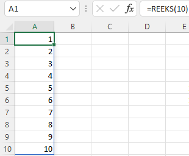
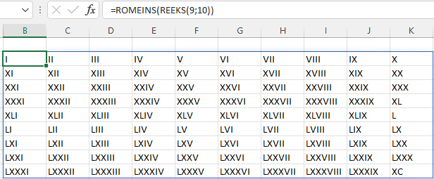
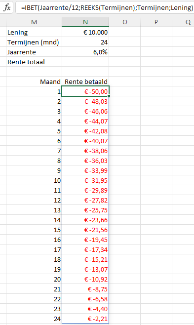
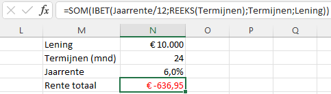

De meeste Excel gebruikers kennen wel de truc om een reeks getallen te produceren door een beginlijstje met een patroon te maken en deze vervolgens uit te breiden door de vulgreep te verslepen. Wanneer je niet meer weet hoe dit werkt, lees dan [Automatisch doorvoeren](https://leerexcel.netlify.app/data.html#data-autofill).

Om een lijst met (opeenvolgende) getallen in een matrix te genereren kun je de functie **REEKS** gebruiken.

Syntax: `REEKS(rijen;[kolommen];[beginnen];[stap])`

+ `rijen`: Het aantal rijen dat moet worden geretourneerd (verplicht).
+ `kolommen`: Het aantal kolommen dat moet worden geretourneerd (optioneel, default 1).
+ `beginnen`: Het eerste getal in de reeks (optioneel, default 1).
+ `stap`: De stapgrootte (optioneel, default 1).

Zo kun je een kolom met de getallen 1 t/m 10 genereren met de formule `=REEKS(10)`

En met de formule `=REEKS(5;4;5;10`) krijg je een matrix van 5 rijen en 4 kolommen, beginnend met getal 5 en de volgende steeds 10 meer.

Je kunt de functie `REEKS` ook opnemen binnen andere functies. Zo kun je eenvoudig een matrix met Romeinse cijfers maken. De formule in het volgende voorbeeld is 
`=ROMEINS(REEKS(9,10))`. Eerst wordt met `REEKS` een lijst getallen van 9 rijen en 10 kolommen gemaakt, beginnend met 1 en steeds 1 meer. Daarna zet de functie `ROMEINS` deze om naar Romeinse cijfers, als tekst.

Tot slot een wat complexer voorbeeld. Stel je hebt een persoonlijke lening van €10.000 afgesloten tegen een jaarlijkse rente van 6% die je in 24 maandelijkse termijnen aflost. Wat is dan het totaal aan rente betaalde bedrag? <!--Inspiratiebron: "Excel Dynamic Arrays, 2ed, Bill Jelen, Hfst 7) -->

Het rentedeel van een maandelijkse aflossing kun je berekenen met de functie `IBET(rente;termijn;aantal-termijnen;huidige-waarde)`

Je zou dan een lijstje met de termijnen 1 t/m 24 kunnen maken en voor elke termijn het rentebedrag kunnen uitrekenen. Om de formules leesbaarder te maken zijn de cellen voor de argumenten van functie van namen voorzien: Lening, Termijnen en Jaarrente.

De matrixformule wordt dan `=IBET(Jaarrente/12;REEKS(Termijnen);Termijnen;Lening)`.

Voor de totaal betaalde rente moet je dan deze bedragen nog optellen.

Je kunt dit bedrag ook vinden zonder eerst de afzonderlijke rentebedragen te bepalen. De formule voor het totale rentebedrag wordt dan

`=SOM(IBET(Jaarrente/12;REEKS(Termijnen);Termijnen;Lening))`

Alle voorbeelden uit dit artikel kun je vinden in het bestand [reeks.xlsx](reeks.xlsx).
