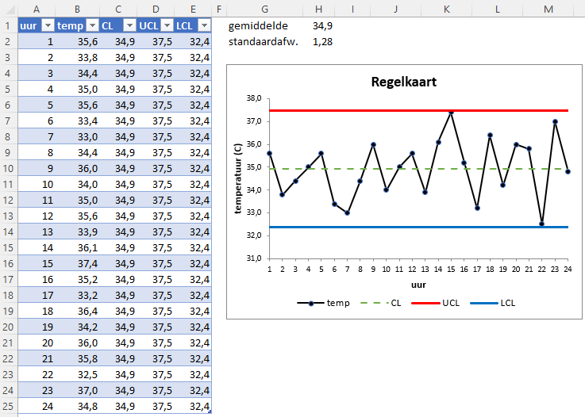

## Regelkaart

Regelkaarten (ook wel controlekaarten genoemd) worden bij statistische procescontrole (SPC) gebruikt om te controleren of een procesvariabele onder controle is. De waarde van zo'n variabele moet daarbij binnen bepaalde grenzen blijven. Een controlekaart is in feite niets anders dan een lijndiagram van de meetwaarden van de variabele met daarbij horizontale lijnen voor de regelgrenzen.

**Regelgrenzen**

+ UCL - Upper Control Limit (Bovenste controlegrens)

+ LCL - Lower Control Limit (Onderste controlegrens)

De regelgrenzen worden uit de data berekend en worden, afhankelijk van het soort proces, op 2-3 standaardafwijkingen van het gemiddelde gezet. Vaak zie je ook nog een horizontale lijn voor het gemiddelde op de regelkaart. Deze lijn wordt ook met CL (Centrale Lijn) aangeduid.

### Voorbeeld

Als voorbeeld een continu chemisch proces waarbij elk uur de temperatuur van het reactiemengsel wordt gecontroleerd. Voor een goede beheersing van dit proces wordt vereist dat de temperatuur binnen 2 standaardafwijkingen van het gemiddelde blijft.

De gegevens zijn ondergebracht in een Excel tabel. In H1 en H2 zijn respectievelijk het gemiddelde en de standaarddeviatie van de temperatuur berekend. 

+ Formule kolom CL: `=$H$1`
+ Formule kolom UCL: `=$H$1+2*$H$2`
+ Formule kolom LCL: `=$H$1-2*$H$2`

Het maken van de grafiek is dan vrij eenvoudig. Selecteer alle gegevens in de tabel, voeg de aanbevolen grafiek in en pas deze daarna desgewenst aan. Het bestand met voorbeeldgegevens en regelkaart kun je downloaden: [spc.xlsx](spc.xlsx)

Er is op internet veel informatie over SPC en regelkaarten te vinden. Een gedegen artikel is [Control Limits and Specifications: The Four Process States](https://www.spcforexcel.com/knowledge/variation/four-process-states).
