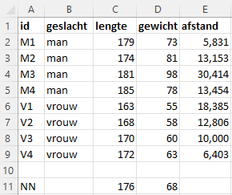
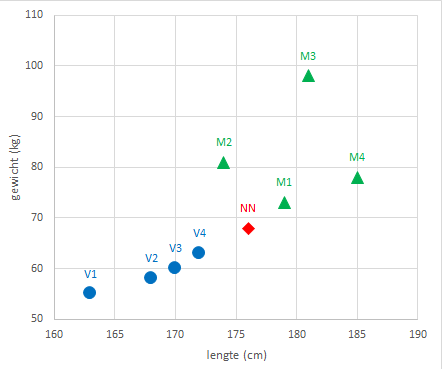
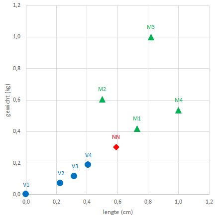

```{r setup, include=FALSE}
knitr::opts_chunk$set(echo = FALSE)
```

Machine Learning is een concept waarbij via een algoritme geprobeerd wordt om patronen in gegevens te ontdekken. Een van de eenvoudigste algoritmes is KNN, wat staat voor *k-Nearest-Neighbor*, oftewel de $k$ dichstbijzijnde buren. Wanneer je het voor classificatie gebruikt, dan wordt een nieuw gegevenspunt in een doelgroep (klasse) ondergebracht op basis van de kenmerken van de $k$ dichtstbijgelegen gegevenspunten.

Nu is Excel niet echt geschikt om Machine Learning technieken toe te passen. Wel kun je het principe van sommige technieken, zoals KNN, goed met behulp van Excel uitleggen.

**Voorbeeld met 1 kenmerk**

Stel je hebt een groep van 8 personen, 4 mannen en 4 vrouwen, waarvan de lengte (cm) bekend is. Bij deze groep komt nu een nieuwe persoon waarvan je alleen de lengte weet, 176 cm. Kun je dan hiermee voorspellen of het een man of een vrouw is?

```{r knn-1dim-data, fig.cap="Lengte van de personen.", out.width="60%"}

```

Voor een vergelijking zijn in figuur \@ref(fig:knn-1dim-grafiek) de lengtes van alle personen op een denkbeeldige meetlat afgebeeld.

```{r knn-1dim-grafiek, fig.cap="Afbeelding van de lengte van de personen op een denkbeeldige meetlat.", out.width="60%"}

```

Het KNN algoritme berekent nu de afstanden van de nieuwe persoon tot alle gecategoriseerde personen, waarvan het geslacht dus bekend is. Onder afstand wordt hier dan het verschil in lengte verstaan. Deze afstanden zijn te zien in figuur \@ref(fig:knn-1dim-data).

Vervolgens worden deze afstanden gerangschikt van de dichtstbijzijnde (meest vergelijkbare) tot de verste (de minst vergelijkbare).

De waarde voor $k$ in het algoritme staat voor het aantal buren waarmee je gaat vergelijken. Elk van deze $k$ buren brengt als het ware een stem uit voor de desbetreffende categorie. De conclusie of de nieuwe persoon een man of een vrouw is wordt dan getrokken op basis van de meeste stemmen.

+ $k=1$: De dichtstbijzijnde persoon is M2. Conclusie: nieuwe persoon = **man**
+ $k=2$: De dichtstbijzijnde personen zijn M2 en M1. Conclusie: nieuwe persoon = **man**
+ $k=3$: De dichtstbijzijnde personen zijn M2, M1 en V4. Conclusie: nieuwe persoon = **man**

<aside>
Om de situatie te voorkomen waarbij de stemmen staken kun je voor $k$ het beste een oneven getal nemen.
</aside>

**Voorbeeld met 2 kenmerken**

Nu is van de 4 mannen en 4 vrouwen naast de lengte (cm) ook het gewicht (kg) bekend. En het gewicht van de nieuwe persoon is 68 kg.

```{r knn-2dim-data, fig.cap="Lengte en gewicht van de personen.", out.width="60%"}

```

In figuur \@ref(fig:knn-2dim-grafiek) is een spreidingsdiagram van gewicht tegen lengte te zien.

```{r knn-2dim-grafiek, fig.cap="Spreidingsdiagram van lengte en gewicht van de personen.", out.width="60%"}

```

Ook nu wordt weer de afstand bepaald van de nieuwe persoon tot de andere personen. Bij twee variabelen wordt de Euclidische afstand bepaald. Voor twee punten $(x_1,y_1$ en $(x_2,y_2$ kun je deze via Pythagoras uitrekenen:

$$\text{afstand } = \sqrt{(x_1 - x_2)^2 + (y_1 - y_2)^2}$$

In figuur \@ref(fig:knn-2dim-data) is de berekende afstand te zien. Daarna wordt weer gekeken welke de dichtstbijzijnde buren zijn.

+ $k=1$: De dichtstbijzijnde persoon is M1. Conclusie: nieuwe persoon = **man**
+ $k=2$: De dichtstbijzijnde personen zijn M1 en V4. Conclusie: geen uitsluitsel, stemmen staken
+ $k=3$: De dichtstbijzijnde personen zijn M1, V4 en V3. Conclusie: nieuwe persoon = **vrouw**

**Voorbeeld met 2 gestandaardiseerde kenmerken**

Verschillende variabelen hebben verschillende schaaleenheden, zoals hier de lengte in cm en  het gewicht in kg. Dat kan er voor zorgen dat variabelen die op een grotere schaal gemeten worden een groter aandeel hebben in de berekende afstand en daardoor belangrijker worden gemaakt dan variabelen die op een kleinere schaal gemeten worden. Om dit te voorkomen kun je de gegevens transformeren naar een nieuwe schaal. Een veel gebruikte techniek hiervoor is de *min-max normalisatie* waarbij de gegevens geschaald worden naar het bereik [0,1]. Hiervoor wordt de kleinste en de grootste waarde van de gegevens bepaald. Vervolgens worden de gegevens gewijzigd via

$\text{genormaliseerde waarde } = \frac{x - min(x)}{max(x) - min(x)}$

In figuur \@ref(fig:knn-2dim-norm-data) zijn de variabelen lengte en gewicht genormaliseerd en is de afstand voor de genormaliseerde gegevens berekend. En in figuur \@ref(fig:knn-2dim-norm-grafiek) zie je de bijpassende grafiek.

```{r knn-2dim-norm-data, fig.cap="Lengte en gewicht van de personen.", out.width="60%"}

```

```{r knn-2dim-norm-grafiek, fig.cap="Spreidingsdiagram van lengte en gewicht van de personen.", out.width="60%"}

```

Wanneer nu naar de dichtstbijzijnde buren gekeken wordt zijn de resultaten iets anders.

+ $k=1$: De dichtstbijzijnde persoon is M1. Conclusie: nieuwe persoon = **man**
+ $k=2$: De dichtstbijzijnde personen zijn M1 en V4. Conclusie: geen uitsluitsel, stemmen staken
+ $k=3$: De dichtstbijzijnde personen zijn M1, V4 en M2. Conclusie: nieuwe persoon = **man**

**Meer dan 2 kenmerken**

Voor meer attributen, bijvoorbeeld hier uitgebreid met de taillemaat, is het principe is hetzelfde. Je kunt het wat moeilijker tekenen en ook het berekenen van de adstand is wat meer werk.

$$\text{afstand} = \sqrt{(x_1 - x_2)^2 + (y_1 - y_2)^2 + (z_1 - z_2)^2 + ... }$$

**kNN in de praktijk**

In de praktijk heb je met grotere datasets te maken. Om de beste waarde voor $k$ te vinden wordt de dataset gesplitst in een groter deel van zo'n 70%-80% van de gegevens om het model te trainen en een resterend kleiner deel om het model te testen. Het trainen en testen gebeurt voor verschillende waarden van $k$. Die waarde van $k$ welke de kleinste voorspelfout geeft wordt dan als beste waarde voor het model gebruikt.

Dit alles is met Excel niet te doen. Daartoe lenen R en Python zich veel beter. Voor beide zijn veel artikelen en tutorials met voorbeelden te vinden.
